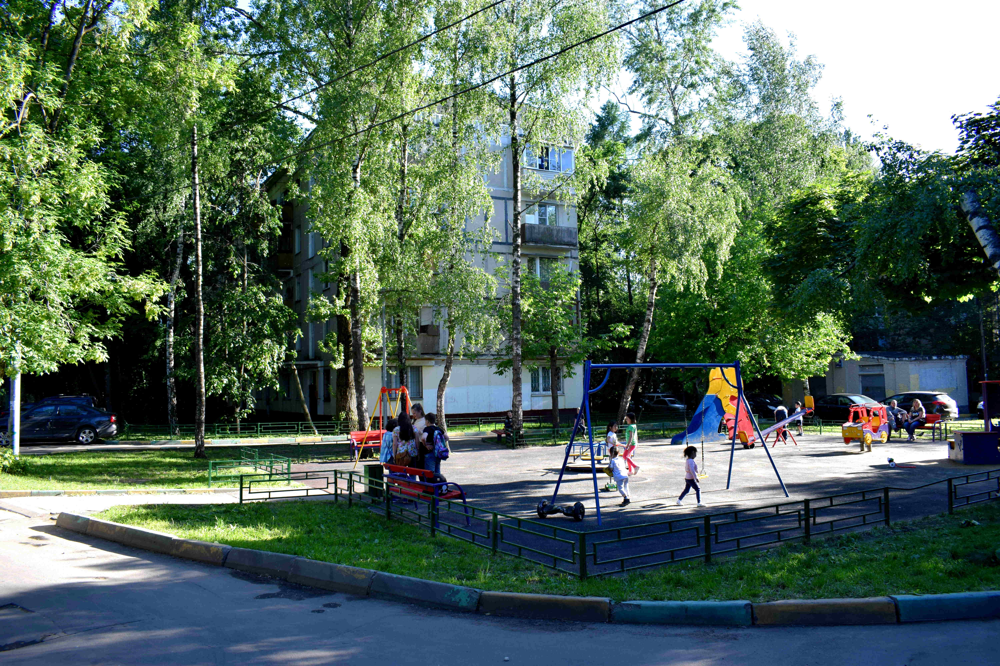
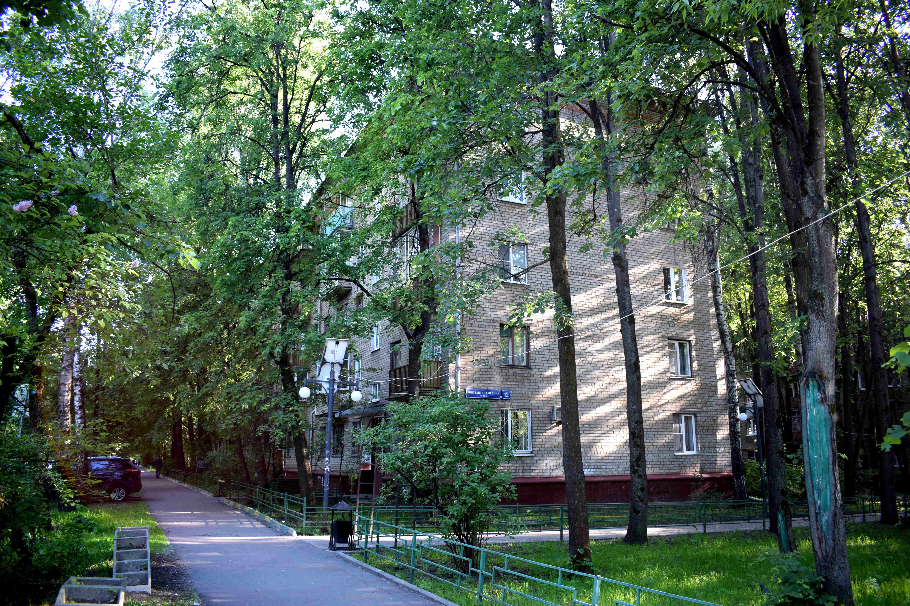
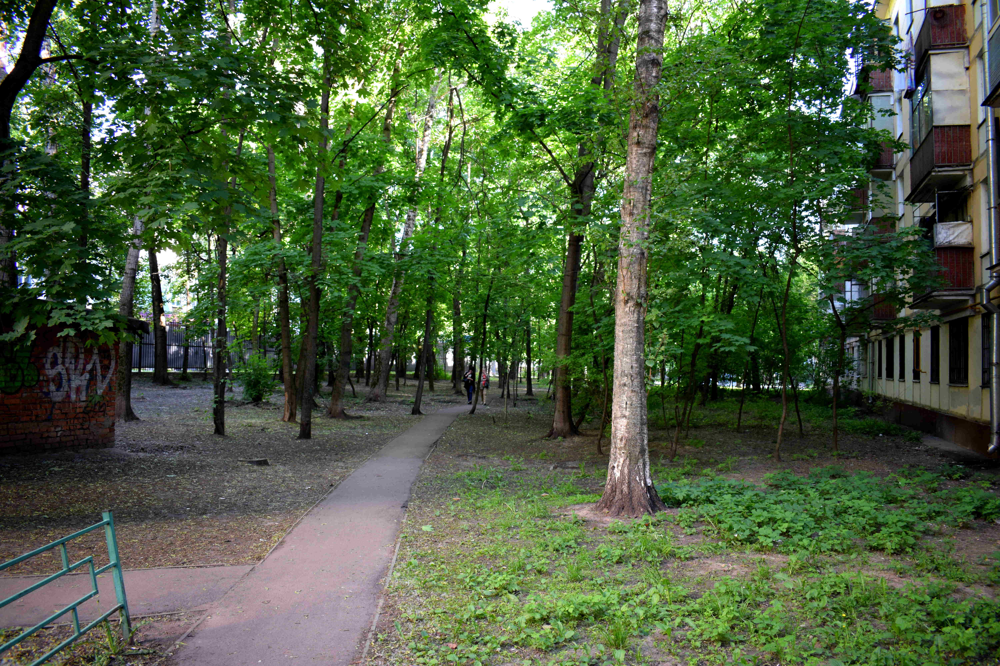

```{r setup, include=FALSE}
knitr::opts_chunk$set(echo = FALSE, message = FALSE, warning = FALSE, fig.asp = 0.618, fig.width = 6, fig.align='center')
# options(device = "X11")
```

```{r}
library(foreign)
library(readr)
library(dplyr)
library(ggplot2)
library(sf)
library(kableExtra)
library(patchwork)
library(ggridges)
library(maps)

# add kable styling theme
```

```{r read in raw datasets}
clean_df <- function(data) {
  data %>% as_tibble() %>% janitor::clean_names()
}

states_dbf_raw <- foreign::read.dbf("./data/raw/states/States.dbf") %>% clean_df()
county_dbf_raw <- foreign::read.dbf("./data/raw/county_subdiv/CtySubdiv.dbf") %>% clean_df()
places_dbf_raw <- foreign::read.dbf("./data/raw/places/Places.dbf") %>% clean_df()
# shape files
states_shp_raw <- sf::read_sf("./data/raw/states/States.shp") %>% janitor::clean_names()
county_shp_raw <- sf::read_sf("./data/raw/county_subdiv/CtySubdiv.shp") %>% janitor::clean_names()
```

```{r early cleaning}

add_land_metrics <- function(data) {
  data %>%
    mutate(prop_developed = tdevelop / lndrasar,
           prop_forested = tforest / lndrasar,
           prop_barren = tbarren / lndrasar,
           prop_shrub = tshrub / lndrasar,
           prop_ag = tagrcltr / lndrasar,
           prop_developed_canopy = devcan / tdevelop
    )
}


states_dbf <- states_dbf_raw %>%
  rename(`state` = name00) %>%
  add_land_metrics() %>%
  mutate(
    forest_area_rank = dense_rank(desc(tforest)),
    pop_den_rank = dense_rank(desc(popden00)),
    pop_rank = dense_rank(desc(pop2000))
  ) %>%
  filter(state != "District of Columbia")

stfips_map <- states_dbf %>% distinct(state, stfips)
states_shp <- states_shp_raw %>%
  rename(`state` = name00) %>%
  mutate(
    prop_developed = tdevelop / lndrasar,
    prop_forested = tforest / lndrasar
  )
county_shp <- county_shp_raw %>%
  rename(`county` = name00) %>%
  inner_join(stfips_map) %>%
  add_land_metrics() %>%
  select(state, county, everything())

county_dbf <- county_dbf_raw %>%
  rename(`county` = name00) %>%
  inner_join(stfips_map) %>%
  add_land_metrics() %>%
  select(state, county, everything())

state_pop_stats <- county_shp %>%
  group_by(state) %>%
  arrange(desc(pop2000)) %>%
  mutate(
    cumsum_pop = cumsum(pop2000),
    cumprop_pop = cumsum_pop / sum(pop2000)
  ) %>%
  mutate(
    populated = if_else(cumprop_pop <= 0.50, TRUE, FALSE),
  ) %>%
  ungroup()

state_pop_stats_dbf <- county_dbf %>%
  group_by(state) %>%
  arrange(desc(pop2000)) %>%
  mutate(
    cumsum_pop = cumsum(pop2000),
    cumprop_pop = cumsum_pop / sum(pop2000)
  ) %>%
  mutate(
    populated = if_else(cumprop_pop <= 0.50, TRUE, FALSE)
  ) %>%
  ungroup()
```

During a trip to Moscow last summer, the most pleasant surprise was the dense, green urban forest that drapes its neighborhoods. With Moscow being one of the largest, densest megacities in the world, I certainly didn't expect this.

Moscow's urban forest is made possible by two components:

1. Dense living
2. **Open space between buildings**

Number two is something I personally haven't seen in any other cities, particularly in the U.S. While the majority of the population lives in 5+ story apartments, there exists significant, open space between buildings. In this space exists pedestrian walkways, playgrounds, schools, and a [**dense, car-free urban forest**](http://www.slavictravels.com/moscow-renovation-program/). It's quite astounding the level of serenity and greenspace that can be achieved in a neighborhood just minutes away from one the densest subway systems in the world.

-----

{ width=33% }{ width=33% }{ width=33% }

-----

While not every district in Moscow looks like this, the images above are quite common for most parts of Northern Moscow.

After a bit of research, I wasn't surprised that [**Moscow ranks first of all megacities in terms of urban forest coverage**](https://www.researchgate.net/figure/Tree-canopy-area-in-each-megacity-showing-existing-cover-and-potential-cover-in-a_fig1_318779295). 

Since this trip, I've wanted to know if any urban areas in the US have a comparable amount of greenspace. As of writing this post, I live in a Bay Area suburb (Walnut Creek, if familiar). To those who are familiar, the Bay Area is an outstanding place if one is interested in nature. I have at my fingertips an almost endless amount of hiking, trails, and other regional parks. Despite this, I still felt more connected to nature during my three weeks living in a Moscow apartment. While there a number of short drives that lead to an abundance of hiking and open space, **the areas that I live and work in are mostly concrete.**

While I don't want to relocate to Moscow, I do want to live and work in places that are *green*. I also value the "outdoorsy" feel of the Bay Area, so having nature activities in proximity to f where I live and work is also important. In this analysis, I will try to identify if I can find anything comparable in the US.

-----

## Grabbing the data

This dataset is provided for free by the the [Northern Research Station of the USDA Forest Service](https://www.nrs.fs.fed.us/).

The data includes urban forest data with respect to the contiguous United States. The data was collected via *"...top-down aerial approaches and bottom-up field data collection"* as part of the [Resource Planning Act](https://www.fs.fed.us/research/rpa/). Data is available at the state, county, and county sub-division level. The data consists of CSVs as well as GIS shapefiles.

A link to downloading the dataset can be found [here](https://www.nrs.fs.fed.us/data/urban/). To better understand the fields included in the data, there is also a helpful [metadata text file](https://www.nrs.fs.fed.us/data/urban/local-resources/documents/metasdata_shp.txt).

-----

## What is an urban forest?

Urban forests are areas of developed land that have ample greenspace and/or tree canopies. 

## Urban forests in USA cities

```{r}


# TODO state/region mapping
#https://www2.census.gov/geo/pdfs/maps-data/maps/reference/us_regdiv.pdf

url = "https://raw.githubusercontent.com/cphalpert/census-regions/master/us%20census%20bureau%20regions%20and%20divisions.csv"
# 9 divionsm, 4 regions
state_region <-read_csv(url(url)) %>% janitor::clean_names()
top_counties <- county_shp %>%
  mutate(prop_developed_canopy = devcan/tdevelop) %>%
  arrange(desc(pop2000)) %>%
  head(50)
top_counties %>%
  ggplot(aes(x = prop_developed_canopy, y = 1, fill=stat(x))) +
    geom_density_ridges_gradient(
    jittered_points = TRUE, scale = .95, rel_min_height = .01, gradient_lwd=1.,
    point_shape = "|", point_size = 3, size = 0.25,
    position = position_points_jitter(height = 0)
  ) +
    scale_fill_gradient(low = "#EED5B7", high = "#228B22") +
  theme_ridges(grid=FALSE) +
  scale_x_continuous(labels=scales::percent) +
  labs(y="",
       x= "Developed Canopy Coverage") +
  guides(fill=FALSE)
```

### My criteria for urban forest

```{r}
# TODO
```

An ideal state for me is one that has a dense urban forest as well as an abundance of nature areas. I've broken it down into three qualifications:

1. **Ample greenspace**

  * The state should contain large swaths of undeveloped land. This could take the form of mountains, forests, trails, etc. I need to be able to escape into large swaths of greenspace without driving half the day. The

2. **Canopies on developed land**

  * Suburban and urban areas should also be green. I don't want the [heat island effect](https://en.wikipedia.org/wiki/Urban_heat_island) effect, and want to feel more connected with nature where I live and work. California fails at this, as the majority of suburbs are concrete-dominant. Those that aren't are either far away from jobs (think remote Northern California) and/or wildfire risks. 

3. **Reasonably, but not overly developed.**

  * It should be easy to find a high-paying job, economy should be stable, and proximity to modern amenities should be seamless. This makes it urban.


-----

### Urban Forest By Region

The [**Census uses a regional/divisional taxonomy**](https://www2.census.gov/geo/pdfs/maps-data/maps/reference/us_regdiv.pdf) to classify states. There are four regions: `Midwest`, `West`, `South`, and `Northeast`.

For each state, let's find the counties that contribute the majority of the state's population. Then, let's measure their *developed canopy coverage*. Developed canopy coverage is the amount of canopy found on developed land.

```{r urban forest by region}
# TODO add metrics definitions higher
region_stats <- state_pop_stats_dbf %>%
inner_join(state_region, by = c("state" = "state")) %>%
  group_by(region) %>%
  mutate(median_devcan = quantile(prop_developed_canopy, 0.5, na.rm=TRUE))

region_stats %>% select(region, median_devcan)

region_stats %>%
  ggplot(aes(x = prop_developed_canopy, y = reorder(region, -median_devcan), fill = stat(x), colour = prop_developed_canopy)) +
  geom_density_ridges_gradient(scale = 1.67, rel_min_height = 0.01, gradient_lwd = 5) +
    scale_fill_gradient(low = "#EED5B7", high = "#228B22") +
  labs(y="",
       x="",
       title = "The South And Northeast Offer The Most Greenspace Within Population Centers",
       subtitle = "Developed canopy coverage where majority of regional population resides") +
  guides(fill=FALSE) +
  scale_x_continuous(labels=scales::percent) +
  theme(panel.grid.minor = element_blank())
```

We find that the `Midwest` and `West` regions have the least green population centers. This makes sense when you reference a forest coverage map for the country. However, states such as `Oregon` and `California` are known for thei

```{r}
# TODO recreate https://upload.wikimedia.org/wikipedia/commons/3/38/Aboveground_Woody_Biomass_in_the_United_States_2011.jpg
```

To account for larger states with diverse biomes, we can compare a state's forest coverage which how much of total U.S. forest area the state accounts for. 

```{r}
# TODO fix plot labels and colors
states_dbf %>%
  mutate(
    prop_developed = tdevelop / lndrasar,
    prop_forested = tforest / lndrasar,
    prop_us_forest = tforest / sum(tforest)
  ) %>%
  inner_join(state_region, by = c("state" = "state")) %>%
  ggplot(aes(x = prop_us_forest, y = prop_forested, colour = region)) +
  geom_point(size = 3) +
 # gghighlight::gghighlight((prop_forested > 0.4 & prop_us_forest < 0.01) |
 #   state == "California") +
  scale_colour_viridis_d() +
  labs(
    title = "Many of the heavily forested states are small",
    x = "% Total U.S. Forest Area",
    y = "",
    subtitle = "Proportion of state land that is forested (y)\nversus proportion of U.S. forest state contributes (x)",
    colour=""
  ) +
  scale_x_continuous(labels = scales::percent) +
  scale_y_continuous(labels = scales::percent) +
  theme(panel.grid.minor = element_blank())
```

Naturally, there is a clear relationship between how forested a state is and how much of total U.S. forest area it constitutes. Obviously, the size of the state is at play here. Due to wide ranges in the size of states, there are also notable exceptions to this. Notice the cluster of Northeastern states in the top-left quadrant. While these states are some of the most forested in the country, their small size limits their utility for those interested in the outdoors. Secondly, most of these states are all sandwiched inside the [**Northeast megalopolis**](https://en.wikipedia.org/wiki/Northeast_megalopolis). It's going to be quite a drive to escape into the backcountry.

Notice how, despite the earlier chart, there are quite bit of `West` and `Midwest` states with decent forest coverage. 

## Canopies on developed land

It's important that greenspace is present near places to live and work. There is [**strong evidence**](https://www.ncbi.nlm.nih.gov/pmc/articles/PMC5663018/) on the positive benefits greenspace has on the mental health of a population. It's important to be surrounded by greenspace without having to drive half of the day to the mountains.

In the underlying GIS data, there is a field `tdevelop`, which signals the total amount of developed land. What is developed land? Developed land follows classes 21-24 from the schema found here:

* [**Multi-Resolution Land Characteristics Consortium**](https://www.mrlc.gov/data/legends/national-land-cover-database-2011-nlcd2011-legend)

From the classes defined by the MLRC, `tdevelop` thus captures a wide range of land uses. Developed land ranges from parks and single-family homes all the way to skyscrapers and factories. The dataset also contains a field `devcan`, which measures the amount of tree canopy on these developed land areas. Given that the majority of time for most people is spent on or near developed land, having ample greenspace in these areas is of utmost importance.

### Which state has the densest developed canopy?

Not surprisingly, there is a strong relationship between how forested a state is and the canopy coverage on its developed land, albeit with some notable exceptions. I've highlighted those that deviate from this pattern.

```{r}
# TODO clean up tibble logic
lm_canopy <- states_dbf %>%
  select(state, prop_developed_canopy, prop_forested) %>%
  filter(prop_forested > 0.2) %>%
  lm(data = ., prop_developed_canopy ~ prop_forested)

canopy_fitted <- broom::augment(lm_canopy, data = states_dbf %>%
  select(state, prop_developed_canopy, prop_forested) %>%
  filter(prop_forested > 0.2)) %>%
  select(state, starts_with("."))
```

```{r}
# TODO add exclusion zone
# TODO make red more earthy
# TODO make above average states green, below average more grey
states_dbf %>%
  select(state, prop_developed_canopy, prop_forested) %>%
  left_join(canopy_fitted, by = c("state" = "state")) %>%
  ggplot(aes(x = prop_forested, y = prop_developed_canopy)) +
  #geom_rect(aes(xmin = 0, xmax = 0.2, ymin = 0, ymax = 0.1), alpha = 1 / 100, colour = "#EE3B3B", fill = "#EE3B3B") +
  #geom_line(aes(x = prop_forested, y = .fitted), colour = "#838B8B", linetype = "dashed") +
  geom_point(size = 3) +
  gghighlight::gghighlight(n = 1, max_highlight = 1, .resid < -0.06 | state == "California" | .resid > 0.08, label_key = state) +
  labs(
    title = "Several high-forested states lack greenspace on developed land",
    subtitle = "How forested a state is versus how forested their developed land is",
    x = "State Forest Percentage",
    y = "Developed Canopy Coverage"
  ) +
  scale_x_continuous(labels = scales::percent) +
  scale_y_continuous(labels = scales::percent)
```

This proves that greenspace is not purely a function of a state's natural biome. Maine, which is over `70%` forested, has less than `10%` developed canopy coverage. Georgia, which is less than `50%` forested, boasts a developed canopy coverage close to `30%`.

### Maine vs. Georgia

Let's zoom in on Maine and Georgia to see why the discrepancy between forest coverage and developed canopy exists.

```{r}


ga_me <- county_shp %>%
  filter(state %in% c("Georgia", "Maine"))

gg_ga <- ga_me %>%
  filter(state == "Georgia") %>%
  ggplot() +
  geom_sf(aes(geometry = geometry, fill = prop_forested), lwd = 0) +
  scale_fill_gradient(low = "#EED5B7", high = "#228B22", labels = scales::percent, breaks = c(0, 0.4, 0.8)) +
  geom_sf(data = state_pop_stats %>%
    filter(state == "Georgia", cumprop_pop <= 0.75), aes(geometry = geometry, alpha = log(prop_developed)),
    lwd=0, colour = "#828282") +
  guides(fill=FALSE, alpha=FALSE)

gg_me <- ga_me %>%
  filter(state == "Maine") %>%
  ggplot() +
  geom_sf(aes(geometry = geometry, fill = prop_forested), lwd = 0) +
  scale_fill_gradient(low = "#EED5B7", high = "#228B22", labels = scales::percent, breaks = c(0, 0.4, 0.8)) +
  geom_sf(data = state_pop_stats%>%
    filter(state == "Maine", cumprop_pop <= 0.75), aes(geometry = geometry, alpha = log(prop_developed)),
    lwd=0, colour = "#828282") +
  guides(fill=FALSE, alpha=FALSE)

gg_ga + gg_me
```

This map makes it obvious that Georgia is significantly more developed than Maine with noticeably less forested land. But, it doesn't explain the discrepancy between their developed canopy coverage. How does Georgia boast a developed canopy with 3x the density of Maine's?

We can see this when we drill into the counties where people actually live. For most states, a small number of counties and/or land mass houses the majority of the population.

```{r}

# TODO county with california
county_cali <- county_shp_raw %>%
  rename(`county` = name00) %>%
  inner_join(stfips_map)


# dist version
# population spread in overall area of land
# need to sum up county size
county_stats <- county_cali %>%
  group_by(state) %>%
  arrange(desc(pop2000)) %>%
  mutate(
    cumsum_pop = cumsum(pop2000),
    cumsum_area = cumsum(lndrasar),
    cumprop_pop = cumsum_pop / sum(pop2000),
    cumprop_area = cumsum_area / sum(lndrasar),
    prop_develop = tdevelop / lndrasar,
  ) %>%
  select(state, county, cumsum_pop, cumprop_pop, cumsum_area, cumprop_area)

# TODO remove grid lines
# TODO change label position to mid point
# TODO make grey lines lighter

# rank them
most_skewed <- county_stats %>%
  filter(cumprop_pop >= 0.95) %>%
  filter(cumprop_area == min(cumprop_area)) %>%
  ungroup() %>%
  mutate(rank = rank(cumprop_area)) %>%
  arrange(rank) %>%
  filter(rank == 1 | rank == 48 | rank == 24 | state == "California") %>%
  as_tibble()
county_stats %>%
  left_join(most_skewed %>% select(state, rank), by = c("state")) %>%
  ggplot(aes(x = cumprop_pop, y = cumprop_area, group=state)) +
  geom_line(size = 1.25, alpha = 1/4) +
  #gghighlight::gghighlight(!is.na(rank)) +
  geom_abline(alpha = 1 / 3, linetype = "dashed") +
  geom_hline(yintercept = 0.25, linetype = "dashed") +
  scale_x_continuous(labels = scales::percent) +
  scale_y_continuous(labels = scales::percent) +
  labs(
    x = "Cumulative Population %",
    title = "Most states concentrate populations into small areas",
    subtitle = "Cumulative state population versus cumulative state area occupied") +
  scale_colour_viridis_d() +
  guides(fill = FALSE) 
```

Knowing this fact, let's define a state's *population centers* as the counties that constitute at least `75%` of their total population. Then, let's compare how forested states are versus how much canopy is present in its population centers.

```{r}
# TODO make x axis labels smaller
# TODO filter on populated counties and show distribution
state_devcan <- state_pop_stats_dbf %>%
  inner_join(states_dbf %>% select(state, prop_forested), by="state", suffix=c("", "_state")) %>%
  mutate(prop_developed_canopy = devcan / tdevelop,
         plot_label = glue::glue("{state} ({scales::percent(prop_forested_state)})"))
state_devcan_rank = state_devcan %>% group_by(state) %>% summarise(mean_devcan = mean(prop_developed_canopy, na.rm=TRUE))
state_devcan %>%
  inner_join(state_devcan_rank) %>%
  filter(state %in% c("Georgia", "Maine", "Connecticut", "Vermont", "Kentucky", "California", "Mississippi", "North Dakota")) %>%
  ggplot(aes(x = prop_developed_canopy)) +
  ggridges::geom_density_ridges(aes(y=reorder(plot_label, prop_forested_state), fill = prop_forested_state), scale = 2) +
  guides(fill=FALSE) +
  scale_fill_gradient(low = "#EED5B7", high = "#228B22", labels = scales::percent, breaks = c(0, 0.4, 0.8)) +
  labs(y="",
       x = "Canopy Coverage",
       title = "Being forested doesn't guarantee urban forests",
       subtitle = "Developed canopy coverage across population centers\nStates ordered by forest coverage (in parentheses)") +
  scale_x_continuous(labels = scales::percent)
```

While it is easier to produce green neighborhoods in forest biomes, this doesn't always occur. For whatever reason, Vermont, the most forested state in the country, shows urban greenspace characteristics similar to California, which has `1/3` of the forest coverage. Georgia, Mississippi, and Connecticut stand out as states with large amounts of greenspace, both developed and undeveloped.

### Digging into Georgia

Georgia stands out in the plot above for a number of reasons:

1. Dense canopy within and surrounding population centers.
2. Major metropolitan area in Atlanta.
3. [**Sunshine**](https://www.nrel.gov/gis/assets/images/nsrdb-v3-ghi-2018-01.jpg)

-----

## The California Paradox

California contains some of the largest swaths of forest land in the contiguous US. For those in tech, it has the best job market in the world. So why does it fail at producing urban forests?

One problem is the distance between California's undeveloped forests and its population centers. A popular weekend destination for Bay Area residents is Tahoe. Getting there requires you to drive 3+ hours, crossing the Central Valley and battling both Bay Area and Sacramento traffic on the way. It is also an expensive hobby. While California boasts some of the best outdoor activities in the world, the distance to reach them can be far. 

On the urban forest front, many California suburbs lack greenspace, particularly for those who aren't wealthy. Those that do exhibit greenspace are either:

* expensive (Marin County, Moraga, Montecito, etc.)
* isolated, far away from jobs (undeveloped, Northern parts of the state)
* wildfire risk for 1/3 of the year
* or any other combination of the above

```{r}
# TODO show bay area and LA counties and developed canopies
```


```{r}
cali <- county_shp %>%
  filter(state %in% c("California")) %>%
  group_by(state) %>%
  mutate(
    prop_develop = tdevelop / lndrasar,
    prop_forested = tforest / lndrasar
  ) %>%
  mutate(prop_develop = if_else(prop_develop < 0.05 | state != "California", NA_real_, prop_develop)) %>%
  ungroup()
```

We can see this when we look at California's population centers and where its forested land resides. Notice the stark contrast between California and our earlier maps of Georgia and Maine. Even in the Atlanta metro area, Georgia was surrounded by immediate greenspace. The majority of California's forest land is highly remote.

```{r}
# TODO add grey mexico
# TODO add labelso of major cities
# TODO make fill legend text smaller and remove plot border
state_pop_stats %>%
  filter(state == "California") %>%
  ggplot(aes(geometry = geometry)) +
  geom_sf(aes(fill = prop_forested), lwd = 0) +
  scale_fill_gradient(low = "#EED5B7", high = "#228B22", labels = scales::percent, breaks = c(0, 0.4, 0.8)) +
  geom_sf(data = state_pop_stats %>%
    filter(state == "California", cumprop_pop <= 0.75), lwd=0, alpha = 3 / 5, fill = "#8A8A8A", colour = "#828282") +
  labs(
    title = "California forests are far from population centers",
    subtitle = "Forest coverage compared to population centers (grey)"
  ) +
  geom_sf(data = states_shp %>% filter(state %in% c("Oregon", "Nevada", "Arizona", "Idaho", "Utah"))) +
  # thick california border
  geom_sf(data = states_shp %>% filter(state == "California"), lwd=1.2, alpha=0) +
  coord_sf(
    crs = st_crs(4267),
    xlim = c(-125.5, -113), ylim = c(32, 43), expand = FALSE
  ) +
  theme(
    panel.background = element_rect(fill = "aliceblue"),
    legend.position = "top"
  ) +
  guides(fill=FALSE)
```

```{r}
# TODO compare developed canopy of different state population centers
```


## Conclusion

